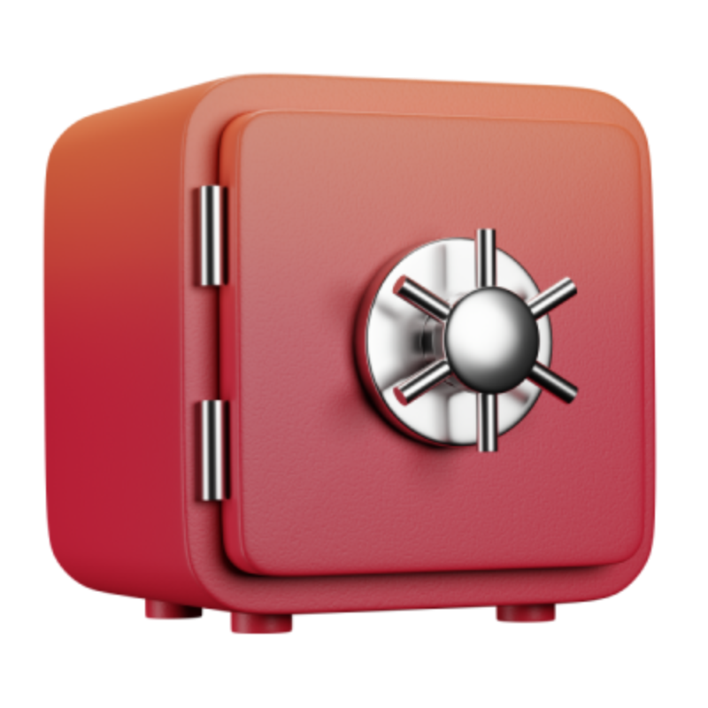

# 

**Velocity** — это интеллектуальный хаб, объединяющий самые передовые нейросети планеты (ChatGPT, Claude, Gemini, Deepseek) в едином интерфейсе для студентов и специалистов. Платформа помогает осваивать сложные темы и лекции в 3 раза быстрее.

---

## ⚡️ Ключевые возможности

###  Безопасность и Доступ
Надежная авторизация пользователей, поддержка двухфакторной аутентификации (2FA) через почту и Telegram, а также полная обфускация и компиляция JS/CSS для максимальной защиты интеллектуальной собственности.

###  Контроль баланса
Гибкий расчет токенов в реальном времени для тарифа PRO. Оплата происходит только за фактическое использование нейросетей, без навязанных ежемесячных подписок.

###  Подпитка знаниями
Умный генератор конспектов. Загружайте PDF-учебники, аудио лекций или ссылки на видео, и система сама сформирует конспект со всеми главными тезисами.

###  Лента новостей
Будьте в курсе всех последних технологических релизов, обновлений нейросетей и новых возможностей платформы в реальном времени.

###  Генерация контента
Инструменты для создания артов, изображений и обработки мультимедиа контента с помощью встроенных ИИ-генераторов.

###  Система наград
Игровая механика достижений и наград, которая стимулирует пользователей ежедневно прокачивать свои навыки и изучать новые материалы.

###  Сообщество (Социум)
Делитесь удачными промптами, обменивайтесь созданными материалами и обсуждайте учебные кейсы с другими участниками.

---

## 🚀 Быстрый запуск

1. **Установите зависимости**:
   ```bash
   pip install -r requirements.txt
   ```
2. **Создайте файл `.env`** и укажите необходимые ключи API.
3. **Запустите проект**:
   ```bash
   python app.py
   ```
   *При запуске бэкенд автоматически скомпилирует, минимизирует и обфусцирует весь фронтенд.*